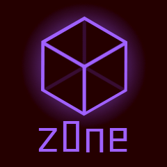

[![Contributors][contributors-shield]][contributors-url]
[![Forks][forks-shield]][forks-url]
[![Stargazers][stars-shield]][stars-url]
[![Issues][issues-shield]][issues-url]
[![Coverage][coverage-shield]][coverage-url]
[![EUPL 1.2 License][license-shield]][license-url]

 

  

<h3 align="center">Bakyun</h3>

  

    More Collections for C# and .net
     
    <a href="https://github.com/cking/z0ne.collections"><strong>Explore the docs »</strong></a>
     
     
    <a href="https://github.com/cking/z0ne.collections/issues/new/choose">Report Bug or request Feature</a>
  

<!-- TABLE OF CONTENTS -->

  
Table of Contents

  <ol>
    <li>
      <a href="#about-the-project">About The Project</a>
      <ul>
        <li><a href="#built-with">Built With</a></li>
      </ul>
    </li>
    <li>
      <a href="#getting-started">Getting Started</a>
      <ul>
        <li><a href="#prerequisites">Prerequisites</a></li>
        <li><a href="#installation">Installation</a></li>
      </ul>
    </li>
    <li><a href="#usage">Usage</a></li>
    <li><a href="#roadmap">Roadmap</a></li>
    <li><a href="#contributing">Contributing</a></li>
    <li><a href="#license">License</a></li>
    <li><a href="#contact">Contact</a></li>
    <li><a href="#acknowledgments">Acknowledgments</a></li>
  </ol>

## About The Project

Additional Collections for C#, born out of the need for a good TreeMap.

(<a href="#readme-top">back to top</a>)

### Built With

(<a href="#readme-top">back to top</a>)

## Getting Started

Install the Nuget Package `Z0ne.Collections` and import the `Z0ne.Collections` namespace

(<a href="#readme-top">back to top</a>)

## Contributing

Contributions are what make the open source community such an amazing place to learn, inspire, and create. Any
contributions you make are **greatly appreciated**.

If you have a suggestion that would make this better, please fork the repo and create a pull request. You can also
simply open an issue with the tag "enhancement".
Don't forget to give the project a star! Thanks again!

1. Fork the Project
2. Create your Feature Branch (`git checkout -b feature/AmazingFeature`)
3. Commit your Changes (`git commit -m 'Add some AmazingFeature'`)
4. Push to the Branch (`git push origin feature/AmazingFeature`)
5. Open a Pull Request

(<a href="#readme-top">back to top</a>)

## License

Distributed under the EUPL 1.2 License. See `LICENSE` for more information.

(<a href="#readme-top">back to top</a>)

## Contact

Kura Bloodlust

- Fediverse: [@kura@z0ne.social](https://z0ne.social/@kura)

Project Link: [https://github.com/cking/z0ne.collections](https://github.com/cking/z0ne.collections)

(<a href="#readme-top">back to top</a>)

## Acknowledgments

* [crates.io/flat-tree](https://crates.io/crates/tree-flat) for inspiration for FlatTree

(<a href="#readme-top">back to top</a>)

<!-- MARKDOWN LINKS & IMAGES -->

[contributors-shield]: https://img.shields.io/github/contributors/cking/z0ne.collections.svg?style=for-the-badge

[contributors-url]: https://github.com/cking/z0ne.collections/graphs/contributors

[forks-shield]: https://img.shields.io/github/forks/cking/z0ne.collections.svg?style=for-the-badge

[forks-url]: https://github.com/cking/z0ne.collections/network/members

[stars-shield]: https://img.shields.io/github/stars/cking/z0ne.collections.svg?style=for-the-badge

[stars-url]: https://github.com/cking/z0ne.collections/stargazers

[issues-shield]: https://img.shields.io/github/issues/cking/z0ne.collections.svg?style=for-the-badge

[issues-url]: https://github.com/cking/z0ne.collections/issues

[license-shield]: https://img.shields.io/github/license/cking/z0ne.collections.svg?style=for-the-badge

[license-url]: https://github.com/cking/z0ne.collections/blob/master/LICENSE.txt

[coverage-shield]: https://img.shields.io/endpoint?url=https://raw.githubusercontent.com/wiki/cking/z0ne.collections/coverage-comment-badge.json&style=for-the-badge

[coverage-url]: https://github.com/cking/z0ne.collections
